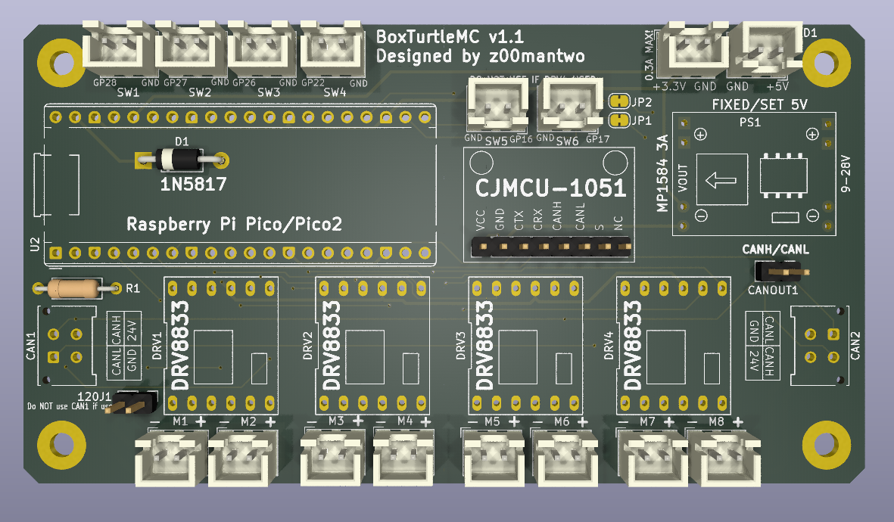
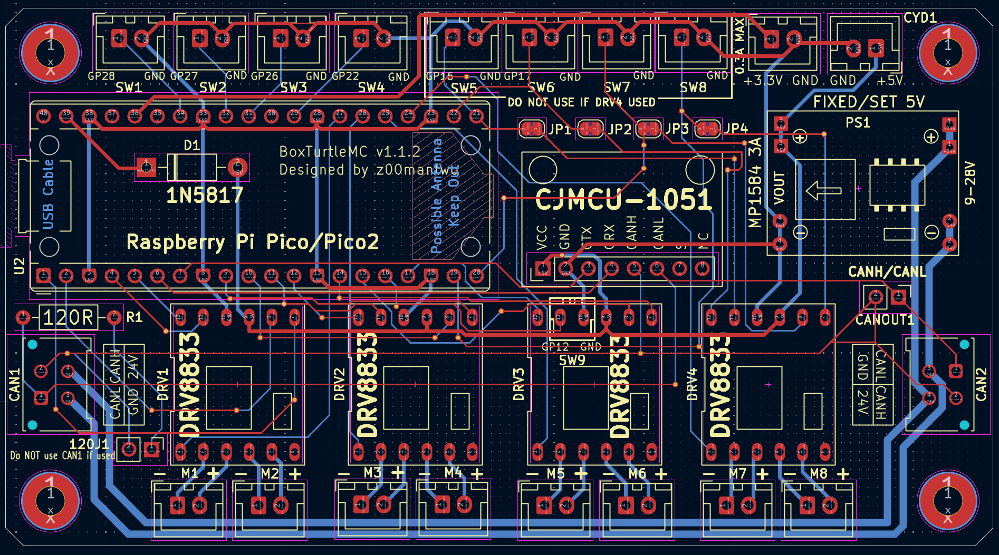
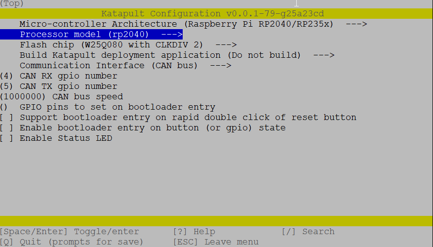
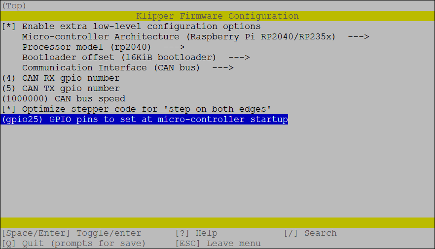
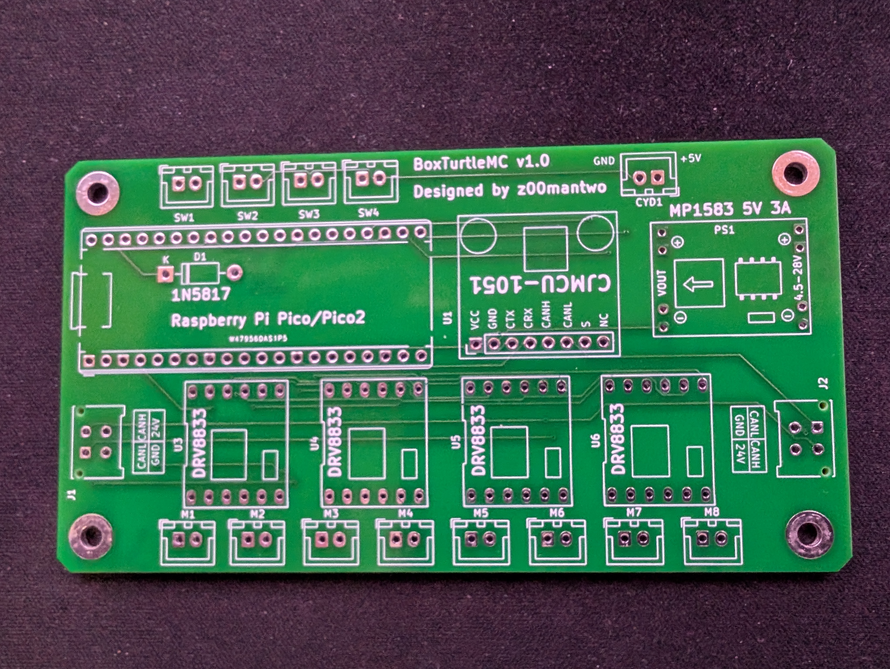

# BoxTurtleMC: BoxTurtle Motor Controller
This is a self sourced DC motor controller for use with [Klipper](https://github.com/ArmoredTurtle/BoxTurtleg) and the  [BoxTurtle](https://klipper3d.org) project. 

The main focus is combining this project with a BigTreeTech MMB this to enable full BoxTurtle control of re-spoolers. It also adds additional support for the "BoxTurtle Lane Controls" mod and "Project TurtleScreen". This board will also have the option of controlling up to 8 re-spooler motors so it should be useful in larger custom BoxTurtle setups with more than 4 lanes. 

# Making a PCB
 

Download the latest zip files from the gerber folder. This file can then be submitted to one of the PCB manufactures online like [PCBWay.com](https://www.pcbway.com/) or [JLCPcb](https://jlcpcb.com/). Orders are usually a minimum of 5 PCBs per order and should be around $30 USD including shipping.

Ideally those who go through the process to make circuit boards will make their extra boards available to others at a minimum cost. 

# BOM
All parts are available on Amazon with the exception of the 2 CANBUS plus.
Those are available at [DigiKey.com](https://DigiKey.com).  
 
- 1 PCB.
- 1 Raspberry Pi Pico or Pico2.
- 1-4 DRV8833 DC motor driver modules. 
	1 to 4 as needed. Each provides control for 2 motors each.
- 1 MP1583 power module. Set to 5V or one fixed to 5V. A fixed voltage module is suggested.
- 1 CJMCU-1051 module for CANBUS connectivity
- Socket connectors are optional, but strongly suggested.
	+ 2 2.54mm 20 pin socket connectors for Pi Pico
	+ 1 2.54mm 8 pin socket connectors for CJMCU-1051
	+ 2 2.54mm 6 pin socket connectors for each DRV8833 module.
- 2 [Molex Micro-Fit 3.0 43045](https://www.digikey.com/en/products/detail/molex/0430450414/252509) connectors. Available from DigiKey.com.
- 2 or more JST XH 2.54mm 2-pin female sockets. This depends on what parts of the board you will make use of.
	

# Tools Needed
- Basic experience soldering components
- Soldering iron with fine tip
- Good solder. 

# Assembling PCB

# Klipper configuration

 

 

# Early release 1.0 boards
Note the 1.0 board does have a known issue. The CANL and CANH pins are reversed. Still works, but where katapult and klipper want to use pins 4 and 5 as defaults you have to switch them to 5 then 4. Version 1.1 board fixes this. 

 