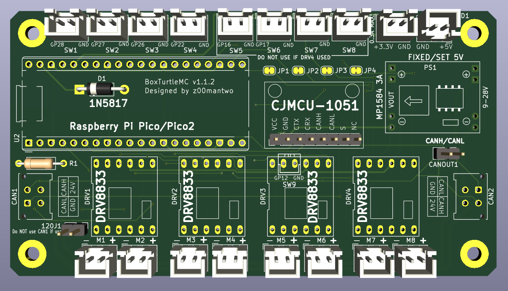

# BoxTurtleMC 
BoxTurtle Motor Controller. This is a self sourced DC motor controller for use with [Klipper](https://github.com/ArmoredTurtle/BoxTurtleg) and the  [BoxTurtle](https://klipper3d.org) project. This is not an official [Armored Turtle](https://github.com/ArmoredTurtle) project. Please read the entire file before ordering any parts so you know your options and what is involved. 



The main focus is combining this project with a [BigTreeTech MMB](https://biqu.equipment/products/bigtreetech-mmb). This will enable full BoxTurtle control of the DC motor powered re-spoolers. It also allows a nice upgrade path from a ERCF to the BoxTurtle. It includes additional switche ports to support the "BoxTurtle Lane Controls" mod and additional power connections to support  [Project TurtleScreen](https://github.com/sbtoonz/TurtleScreen). This board will also have the option of controlling up to 8 re-spooler motors so it should be useful in larger custom BoxTurtle setups with more than 4 lanes. 

The board was developed in the free version of [KiCAD](https://www.kicad.org/). So it can be downloaded and modified.

Note there is a mount for the board in the stl folder.

## Making a PCB
 

Download the latest zip file from the gerber folder. This file can then be submitted to one of the PCB manufactures online like [PCBWay.com](https://www.pcbway.com/), [HQ NextPCB](https://www.nextpcb.com/), [ALLPCB](https://www.allpcb.com/) or [JLCPcb.com](https://jlcpcb.com/). Orders are usually a minimum of 5 PCBs per order and should be around $30 USD for 5 boards including shipping. If this is your first time doing this there are often "first time customer" discounts that can push the cost below $20 including shipping. I suggest shopping around to find the best deal. 

Ideally those who go through the process to make circuit boards will make their extra boards available to others at a minimum cost. The "[Garage Sale](https://discord.com/channels/1229586267671629945/1320411766290907238)" forum in the BoxTurtle Dsscord is a great place to do this. 

## BOM
All parts are available on Amazon with the exception of the 2 CANBUS plugs.
Those are available at [DigiKey.com](https://DigiKey.com).  


| Item | Quantity | Notes | Links |
| :--- | :---: |:--- | :--- |
PCB | 1 | Required. See "Making a PCB" section | 
Raspberry Pi Pico or Pico 2 | 1 | Required. "W"ireless version is not needed, but will work. | [Amazon](https://www.amazon.com/s?k=Raspberry+Pi+Pico)
1N5817 Diode | 1 | Required. |[Amazon](https://www.amazon.com/s?k=1N5817+Diode)
MP1583EN DC-DC buck converter | 1 | Required. 5V FIXED version highly suggested. Make sure to get version with 8 mounting holes. |  [Amazon](https://www.amazon.com/s?k=MP1583EN+dc-dc+5v+buck+converter)
CJMCU-1051 | 1 | Requied if using CANBUS. CANBUS is the suggested communications method. | [Amazon](https://www.amazon.com/s?k=CJMCU-1051)
DRV8833 DC Motor Driver | 2-4 | One required for each pair of motors. Make sure to get the 12pin 1.5A Dual H Bridge version. | [Amazon](https://www.amazon.com/s?k=DRV8833+DC+Motor+Driver+Controller+Board+3A+Dual+H+Bridge)
Molex Micro-Fit 3.0 43045 | 2 | CANBUS socket | [Digikey](https://www.digikey.com/en/products/detail/molex/0430450414/252509)
2.54mm 20 pin female header | 2 |  To socket Pi Pico/Pico 2 | [Amazon](https://www.amazon.com/s?k=2.54mm+Female+Pin+Header)
2.54mm 8 pin female pin header | 1 | For CJMCU-1051.  | [Amazon](https://www.amazon.com/s?k=2.54mm+Female+Pin+Header)
2.54mm 6 pin female pin header | 4 or more | 2 for each DRV8833 module.  | [Amazon](https://www.amazon.com/s?k=2.54mm+Female+Pin+Header)
JST XH 2.54mm 2-pin female sockets | 4 or more | This depends on what parts of the board you will make use of. | [Amazon](https://www.amazon.com/s?k=JST-XH+2.54mm+2pin+female+sockets) 
Through hole 120 Ohm axial resister | 1 | Only needed if CANBUS termination is needed. |  
2pin 2.54mm Pitch Single Row Pin Header | 1,2 | Used for jumper to turn on CANBUS termination. Another one is used for CANH/CANL connection. Both are optional. | [Amazon](https://www.amazon.com/s?k=2.54mm+Pitch+Single+Row+Pin+Header)


If you need to terminate this board use the CAN2 connector for the incoming CANBUS connection. Do not use the CAN1 connection when terminated. 

Note when ordering the Molex Micro-Fit 3.0 connector headers you may also want to order some [Molex Micro-Fit 3.0 plugs](https://www.digikey.com/en/products/detail/molex/0430250408/4481508) along with the appropriate pins [Molex 0430300007](https://www.digikey.com/en/products/detail/molex/0430300007/252479). Since DigiKey allows ordering in specified quantities as low as 1 this may also be a good place to source the needed diode and optional resister.

## Tools Needed
- Basic experience soldering components.
- Soldering iron with fine tip.
- Good solder. Thinner is better.

## Assembling PCB
Solder on the 2 CANBUS plugs and the MP1583EN module. It is recommended that the MP1583EN be soldered to the board and not socketed. If you didn't get a fixed 5V MP1583EN then make sure to set it to 5V. You can do this by connecting the board to a CANBUS connection and adjusting the potentiometer on the MP1583EN while monitoring the output voltage via the 5V connector with a multi meter. Note a fixed 5V MP1583EN is suggested to bypass this step and avoid issues.

Solder in the 1N5817 diode. Note if you are soldering the Pico to the board (not recommended) the diode will need to be installed on the back of the circuit board.

Next solder on the socket connectors as needed. It is recommended to socket the Pico and the DRV8833 modules. The DRV8833 modules are sensitive to static shock. So this makes them easy to replace if needed. 

Solder in the optional CANBUS terminator resister and pin header if needed.

## CANBUS: Flashing Katapult and Klipper

CANBUS needs to already setup on your printer. The [Esoterical’s guide](https://canbus.esoterical.online/) is a great resource.

First step is to put Katapult on the Pi Pico. If Katapult isn't already on your Klipper host follow the instructions from the Katapult website to install it on your Klipper host. Instructions are available at [https://github.com/Arksine/katapult](https://github.com/Arksine/katapult). 

Configure katapult as shown below.

 

Note if you are using a Pi Pico 2 change the "Processor Model" to rp2350.

After configuring and making katapult. Connect your Pi Pico while pressing the boot button on the Pico via USB to your klipper host. It is suggested the Pico is not in the BoxTurtleMC board at this point. 

Then at the hosts command line type lsusb. The Pico should be listed as "Raspberry Pi RP2040 Boot" or "Raspberry Pi RP2350 Boot" if it's a Pico 2. Make a note of the Pico's address. It should be something like "2e8a:000f" as shown below. 

```
~/katapult $ lsusb
Bus 002 Device 002: ID 2109:0817 VIA Labs, Inc. USB3.0 Hub
Bus 002 Device 001: ID 1d6b:0003 Linux Foundation 3.0 root hub
Bus 001 Device 007: ID 0eef:0005 D-WAV Scientific Co., Ltd WS170120
Bus 001 Device 009: ID 1d50:614e OpenMoko, Inc. rp2040
Bus 001 Device 012: ID 2e8a:000f Raspberry Pi RP2350 Boot
Bus 001 Device 006: ID 1d50:606f OpenMoko, Inc. Geschwister Schneider CAN adapter
Bus 001 Device 002: ID 2109:3431 VIA Labs, Inc. Hub
Bus 001 Device 001: ID 1d6b:0002 Linux Foundation 2.0 root hub
```

Now flash the Pico using the following command `sudo make flash device=2e8a:000f` substituting the address of your Pico while in the katapult directory. You should see several messages like below after flashing is complete.

```
~/katapult $ sudo make flash device=2e8a:000f
Flashing out/katapult.uf2
Loaded UF2 image with 29 pages
Found rp2040 device on USB bus 1 address 11
Flashing...
Resetting interface
Locking
Exiting XIP mode
Erasing
Flashing
Rebooting device
```

Put you Pico in the BoxTurtleMC board and connect the board to your CANBUS cable. Make sure to power everything off before doing that and then bring everything back up.

Check if the Pico is detected on the CANBUS with the command:

```
~/klipper $ ~/klippy-env/bin/python ~/klipper/scripts/canbus_query.py can0
Found canbus_uuid=05a32df28477, Application: Klipper
Total 1 uuids found
```

If the Pico isn't found then something went wrong in the process of flashing or something is wrong with your CANBUS cabling.

Record the UUID given for the Pico. You will need this to flash klipper and to configure klipper.

Reconnect to the command line on your klipper host. Next change to the klipper directory. There run the command `make menuconfig` and change the settings as shown below.

 

Note if you are using a Pi Pico 2 change the "Processor Model" to rp2350.

Make klipper then flash it to the Pico with the command below. Substitute the uuid (XXXXXXXXXXXX) with your Pico's uuid you recorded above.

```
cd ~/katapult/scripts && python3 flashtool.py -i can0 -f ~/klipper/out/klipper.bin -u XXXXXXXXXXXX
```

If all is well the Pico will reboot and there should be a green light on the Pi Pico and a red light on each DRV8833. If the Pico light does not come on power off and back on. If it still does not come on something went wrong along the way. 

## Klipper configuration

Copy the `MC_1.cfg` in the klipper folder to your klipper configurations folder. 

Then add

```
[include MC_1.cfg]
```

to your `printer.cfg`. Make sure this is before you load the [AFC-Klipper-Add-On](https://github.com/ArmoredTurtle/AFC-Klipper-Add-On/tree/main) cfg files. 

Note that with the DRV8833 modules use one line controls the SLEEP/ENABLE option for 2 motors. So rather than a MOT1_EN alias the BoxTurtleMC has a MOT12_EN alias that is the ENABLE function for both motor 1 and motor 2.

This then requires setting a `[duplicate_pin_override]` section in your klipper configuration. See the example near the end of the `MC_1.cfg` file for an example. Note that if you don't have a `[duplicate_pin_override]` section in your current configuration you can uncomment the section in the `MC_1.cfg` file.

If you are combining the BoxTurtleMC with BTT MMB you will need to edit the AFC/mcu/MMB_1.0.cfg or MMB_1.1.cfg and remove or comment out the MOT lines by placing a # in front of each line.

```
	#MOT1_RWD=PA0	, 
	#MOT2_RWD=PA1	, 
	#MOT3_RWD=PB10	, 
	#MOT4_RWD=PB2	,
```

Then you need to change the "afc_motor" entries in your `AFC/AFC_Turtle_1.cfg` file for each lane that you want the re-spooler motors controlled by the BoxTurtleMC. For example change

```
afc_motor_rwd: Turtle_1:MOT1_RWD
afc_motor_fwd: Turtle_1:MOT1_FWD
afc_motor_enb: Turtle_1:MOT1_EN
```

to

```
afc_motor_rwd: MC_1:MOT1_RWD
afc_motor_fwd: MC_1:MOT1_FWD
afc_motor_enb: MC_1:MOT12_EN
```

You will need to do this for each lane that you want the BoxTurtleMC to control the DC motor in the re-spooler. 

Use the [AFC Klipper Add-on](https://github.com/ArmoredTurtle/AFC-Klipper-Add-On/)'s "TEST lane=lane1" to check each motor control is setup properly. 

## Options
- You can use a JST XH 2.54mm 2-pin female socket for the CANH/CANL rather than a 2 pin header if you want.
 
- Only purchasing the components you need. All locations on the board do not need to be populated. You can choose and select the ones you want to populate based on your intended usage. Below is a board setup to only use motors 1-4.


- A question was asked about using this board with a cheap Ender 3 SKR board. Most of the SKR boards only have 4 switches. X, Y, Z limit switches and a filament detection switch. When combined with this board's 6 switches that would only be 10 switches and 11 are needed for a 4 lane BoxTurtle. The DRV3 socket can be used to add a 7th switch as shown below. Make sure to orient the socket as shown. This would make the 7th switch GPIO12. NOTE THIS HAS NOT BEEN TESTED, but should work.


- Using USB rather than CANBUS. This board can be used by klipper through the USB connector on the Pi Pico. The CJMCU-1051 could then be excluded, but the board would still need external 24V power for the DRV8833s. This can be connected via one of the CANBUS connectors. This will require install klipper (no katapult) as configured below. Only recommended for experienced klipper users. 


Note if you are using a Pi Pico 2 change the "Processor Model" to rp2350.

## Version 1.1.2 boards (Current Release)
This is a minor upgrade over 1.1 boards. It added 2 additional switches when DRV4 is not populated and an additional 9th switch when DRV3 is also not populated. This is primarily to support using this board with MCUs that have a limited number of switch connections. To get to the required 11 switches needed for a base model, 4 lane, BoxTurtle.

## Version 1.1 boards
Release 1.1 boards only included 6 switches. Two of which only worked if DRV4 is left empty. This was the first version released. 


## Early release 1.0 boards
Note the 1.0 board does have a known issue. The CANL and CANH pins are reversed. Still works, but where katapult and klipper want to use pins 4 and 5 as defaults you have to switch them to 5 then 4. Version 1.1 board fixes this. See the screenshots in the "Flashing Katapult and Klipper" section above.

 
